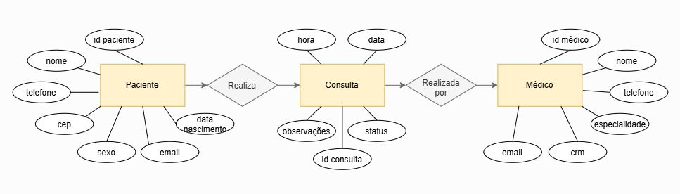
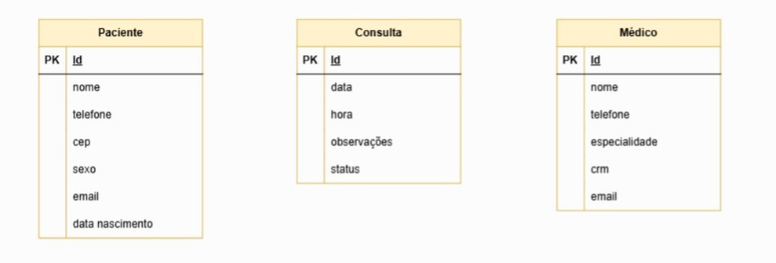

# Projeto: Clínica médica

## Dicionário de Dados

| Entidade | Atributo | Tipo | Tamanho | Descrição |
|-|-|-|-|-|
| Paciente | id_paciente | int | 11 | Chave primaria do paciente |
| Paciente | nome | varchar | 50 | Nome do paciente |
| Paciente | data_nascimento | date |-| Data de nascimento do paciente |
| Paciente | sexo | char | 1 | Sexo do paciente (M/F) |
| Paciente | telefone | varchar | 15 | Telefone para contato do paciente |
| Paciente | email | varchar | 100 | E-mail do paciente |
| Paciente | endereco | varchar | 200 | Endereço residencial do paciente |
| Consulta | id_consulta | int | 11 | Chave primária da consulta |
| Consulta | data_hora |datetime |-| Data e horário da consulta |
| Consulta | motivo | varchar | 200 | Motivo da consulta |
| Consulta | observacoes | varchar | 500| Observações da consulta |
| Consulta | status | varchar | 15 | Situação da consulta |
| Consulta | id_paciente | int | 11 | Chave estrangeira referência Paciente(id_paciente) |
| Consulta | id_medico | int | 11 | Chave estrangeira referência Medico(id_medico) |
| Médico | id_medico |int | 11 | Chave primária do médico |
| Médico | nome | varchar | 50 | Nome completo do médico |
| Médico | especialidade | varchar | 50 | Especialidade do médico |
| Médico | crm | varchar | 20 | Registro do médico no CRM |
| Médico | telefone | varchar| 15 | Telefone para contato do médico |
| Médico | email | varchar | 100| E-mail do médico |

## Dados de teste em CSV
- [pacientes.CSV](./pacientes.CSV)
- [medicos.CSV](./medicos.CSV)
- [consultas.CSV](./consultas.CSV)