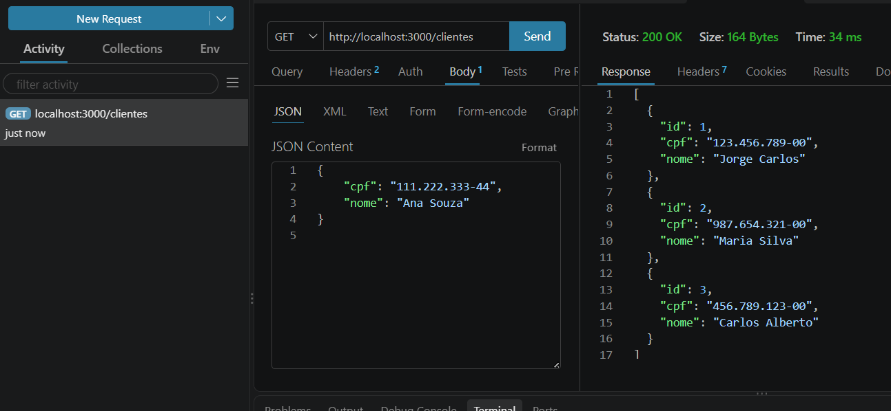
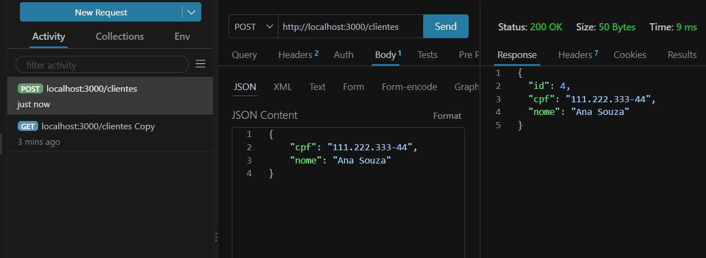
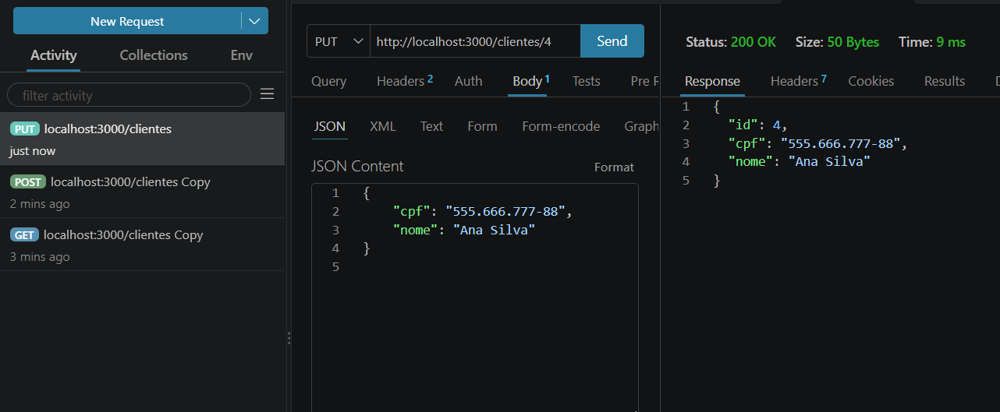
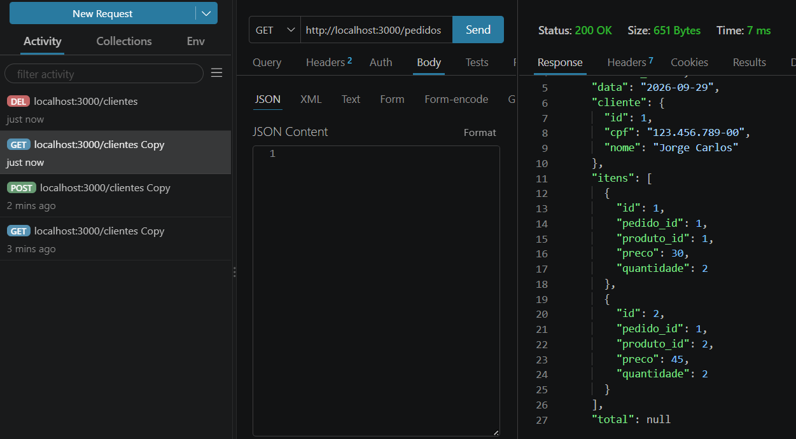
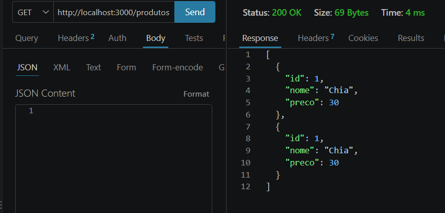
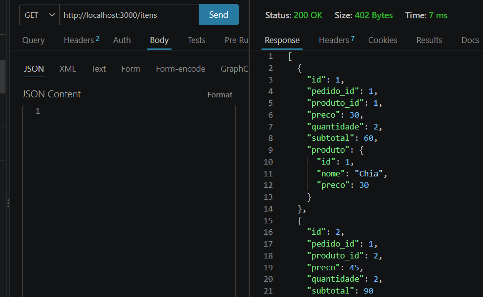

# Aula 08

## Projeto

API de pedidos desenvolvida utilizando Node.js e Express.

O projeto trabalha com:

- Clientes
- Pedidos
- Produtos
- Itens

Também foram aplicados os relacionamentos de composição e agregação apresentados na aula.

## CRUD de Clientes

### Listar clientes

### Criar cliente

### Alterar cliente

### Excluir cliente

## CRUD de Pedidos

### Listar pedidos

## CRUD de Produtos

### Listar produtos

## CRUD de Itens

### Listar itens e calcular subtotal

## Desafio - calcTotais

Foi criada a função `calcTotais` para calcular o total de cada pedido a partir dos subtotais dos seus itens.

